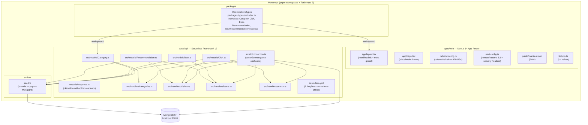

# Architecture: IAS-1 — Infraestrutura & Scaffold do Monorepo

## Visão de Alto Nível

### Estado Anterior (agora)
```
sommeliere-de-cerveja/
├── .git/
├── .claude/
├── master-docs/       ← apenas documentação
└── README.md
```

### Estado Posterior (após este Epic)
```
sommeliere-de-cerveja/
├── apps/
│   ├── web/           ← Next.js 14 + Tailwind + Shadcn/UI base
│   └── api/           ← Serverless Framework v3 + Mongoose models
├── packages/
│   └── types/         ← @sommeliere/types (interfaces compartilhadas)
├── scripts/
│   └── seed.ts        ← populador idempotente do MongoDB
├── .claude/
├── master-docs/
├── pnpm-workspace.yaml
├── package.json       ← root workspace
├── turbo.json         ← pipelines: build, dev, lint
├── .gitignore
└── .npmrc
```

---

## Diagrama de Componentes



---

## Detalhes por Componente

### 1. Root Workspace

**`pnpm-workspace.yaml`**
```yaml
packages:
  - 'apps/*'
  - 'packages/*'
```

**`turbo.json`** (Turbo 2.x — usa `tasks`, não `pipeline`)
```json
{
  "$schema": "https://turbo.build/schema.json",
  "tasks": {
    "build": {
      "dependsOn": ["^build"],
      "outputs": [".next/**", "!.next/cache/**", ".serverless/**", "dist/**"]
    },
    "dev": {
      "cache": false,
      "persistent": true
    },
    "lint": {
      "outputs": []
    }
  }
}
```

**`package.json` (root)**
- `devDependencies`: `turbo`, `typescript`, `ts-node`, `@types/node`, `dotenv`
- `scripts`: `"dev": "turbo dev"`, `"build": "turbo build"`, `"seed": "ts-node scripts/seed.ts"`

**`.npmrc`**
```
shamefully-hoist=true
```
> Necessário para pnpm + Next.js (evita erros de resolução de peer dependencies)

---

### 2. packages/types

**Estratégia:** Package TypeScript puro sem build step. Os apps consomem o source `.ts` diretamente.

**`package.json`**
```json
{
  "name": "@sommeliere/types",
  "version": "0.1.0",
  "main": "./src/index.ts",
  "types": "./src/index.ts",
  "exports": {
    ".": "./src/index.ts"
  }
}
```

**`src/index.ts`** — interfaces exportadas:
```typescript
export interface Category { slug, name, icon, order, active }
export interface Dish { slug, name, category_id, image_url, search_tags, active }
export interface Beer { slug, name, brand, style, sensory_profile, general_pairings,
  image_url, serving_temp_min, serving_temp_max, glass_type, display_order, active }
export interface Recommendation { dish_id, beer_id, affinity_score, harmony_principle,
  recommendation_title, sensory_explanation, active }
export interface DishRecommendationResponse { dish: {...}, recommendations: Array<{beer, affinity_score, ...}> }
```

**⚠️ Integração com apps/web:** `next.config.ts` precisa de `transpilePackages: ['@sommeliere/types']` para que o Next.js compile o `.ts` do pacote.

**⚠️ Integração com apps/api:** `serverless-esbuild` compila TypeScript nativamente — sem configuração extra.

---

### 3. apps/web

**Dependências principais:**
| Pacote | Versão | Razão |
|---|---|---|
| `next` | `14` | App Router + ISR + Server Components |
| `react` / `react-dom` | `^18` | - |
| `typescript` | `^5` | - |
| `tailwindcss` | `^3` | utility-first CSS |
| `clsx` | `^2` | class merging |
| `tailwind-merge` | `^2` | deduplication de classes Tailwind |
| `@sommeliere/types` | `workspace:*` | interfaces compartilhadas |

**`tailwind.config.ts`** — tokens Heineken:
```typescript
theme: {
  extend: {
    colors: {
      heineken: {
        green: '#288154',
        'green-dark': '#1a5c3a',
        'green-light': '#34a066',
      }
    }
  }
}
```

**`next.config.ts`**:
```typescript
const config: NextConfig = {
  transpilePackages: ['@sommeliere/types'],
  images: {
    remotePatterns: [
      { protocol: 'https', hostname: '*.amazonaws.com' },  // S3 futuro
    ],
  },
  async headers() {
    return [{
      source: '/(.*)',
      headers: [
        { key: 'X-Frame-Options', value: 'DENY' },
        { key: 'X-Content-Type-Options', value: 'nosniff' },
        { key: 'Referrer-Policy', value: 'strict-origin-when-cross-origin' },
      ]
    }]
  }
}
```

**`public/manifest.json`** (PWA):
```json
{
  "name": "Sommelière de Cerveja",
  "short_name": "Sommelière",
  "start_url": "/",
  "display": "standalone",
  "theme_color": "#288154",
  "background_color": "#ffffff",
  "icons": [
    { "src": "/icon-192.png", "sizes": "192x192", "type": "image/png" },
    { "src": "/icon-512.png", "sizes": "512x512", "type": "image/png", "purpose": "any maskable" }
  ]
}
```

**Ícones:** Placeholders SVG convertidos para PNG (192x192 e 512x512) com fundo `#288154` e letra "S".

**`app/layout.tsx`** — deve incluir:
```html
<link rel="manifest" href="/manifest.json" />
<meta name="theme-color" content="#288154" />
<meta name="viewport" content="width=device-width, initial-scale=1, viewport-fit=cover" />
```

---

### 4. apps/api

**Dependências principais:**
| Pacote | Versão | Razão |
|---|---|---|
| `mongoose` | `^8` | ODM MongoDB |
| `@sommeliere/types` | `workspace:*` | interfaces compartilhadas |
| `serverless` | `^3` (dev) | deploy Lambda |
| `serverless-offline` | `^13` (dev) | dev local |
| `serverless-esbuild` | `^1` (dev) | compilação TS → JS |
| `esbuild` | `^0.20` (dev) | bundler |
| `typescript` | `^5` (dev) | - |
| `@types/node` | `^20` (dev) | - |

**`serverless.yml`** — estrutura com 7 funções:
```yaml
service: sommeliere-api
frameworkVersion: '3'
provider:
  name: aws
  runtime: nodejs18.x
  region: sa-east-1
  environment:
    MONGODB_URI: ${env:MONGODB_URI}
plugins:
  - serverless-esbuild
  - serverless-offline
custom:
  esbuild:
    bundle: true
    minify: false
    sourcemap: true
    target: node18
  serverless-offline:
    httpPort: 3001
functions:
  categories: { handler: src/handlers/categories.list, events: [...] }
  categoryDishes: { handler: src/handlers/categories.dishes, ... }
  dishRecommendations: { handler: src/handlers/dishes.recommendations, ... }
  beers: { handler: src/handlers/beers.list, ... }
  beerDetail: { handler: src/handlers/beers.detail, ... }
  beerDishes: { handler: src/handlers/beers.dishes, ... }
  search: { handler: src/handlers/search.search, ... }
```

**`src/db/connection.ts`** — padrão de cache serverless:
```typescript
// Variável global persiste entre invocações na mesma instância Lambda
declare global { var mongooseCache: { conn: typeof mongoose | null; promise: Promise<typeof mongoose> | null } }
if (!global.mongooseCache) global.mongooseCache = { conn: null, promise: null }

export async function connectDB() {
  if (global.mongooseCache.conn) return global.mongooseCache.conn
  if (!global.mongooseCache.promise) {
    global.mongooseCache.promise = mongoose.connect(process.env.MONGODB_URI!)
  }
  global.mongooseCache.conn = await global.mongooseCache.promise
  return global.mongooseCache.conn
}
```

**`src/utils/response.ts`** — helpers HTTP padronizados:
```typescript
type Headers = { 'Content-Type': 'application/json'; 'Access-Control-Allow-Origin': '*' }
export const ok = <T>(data: T) => ({ statusCode: 200, body: JSON.stringify({ data }) })
export const notFound = (msg: string) => ({ statusCode: 404, body: JSON.stringify({ error: msg }) })
export const badRequest = (msg: string) => ({ statusCode: 400, body: JSON.stringify({ error: msg }) })
export const error = (msg: string) => ({ statusCode: 500, body: JSON.stringify({ error: msg }) })
// Todos incluem CORS headers
```

**Models Mongoose** — campos por collection:

| Model | Campos | Índices |
|---|---|---|
| `Category` | slug (unique), name, icon, order, active (default true) | `{ slug: 1 }` unique |
| `Dish` | slug (unique), name, category_id (ref), image_url, search_tags[], active (default true) | `{ slug: 1 }` unique, `$text { name, search_tags }` portuguese, `{ category_id, active }` |
| `Beer` | slug (unique), name, brand, style, sensory_profile, general_pairings, image_url, serving_temp_min, serving_temp_max, glass_type, display_order, active (default true) | `{ slug: 1 }` unique |
| `Recommendation` | dish_id (ref), beer_id (ref), affinity_score (0-100), harmony_principle (enum), recommendation_title, sensory_explanation, active (default true) | `{ dish_id, active, affinity_score: -1 }`, `{ beer_id, active, affinity_score: -1 }` |

---

### 5. scripts/seed.ts

**Localização:** `scripts/seed.ts` (root do monorepo)

**Execução:** `pnpm seed` → `ts-node scripts/seed.ts`

**Estratégia de idempotência:**
```
1. conectar MongoDB
2. deleteMany em todas as collections (ordem inversa de dependência)
   Recommendations → Dishes → Beers → Categories
3. inserir Categories (8)
4. inserir Beers (8)
5. inserir Dishes (~50, referenciando category._id)
6. inserir Recommendations (1-5 por prato, referenciando dish._id e beer._id)
7. desconectar e logar resumo
```

**Dados do seed:**

*8 Categorias:*
```
Carnes (🥩, order:1), Frutos do Mar (🦐, order:2), Massas (🍝, order:3),
Petiscos (🍟, order:4), Vegetariano (🥗, order:5), Sushi/Oriental (🍱, order:6),
Sobremesas (🍮, order:7), Outros (🍽️, order:8)
```

*8 Cervejas (portfólio Heineken):*
```
heineken-lager, amstel-puro-malte, eisenbahn-pilsen, eisenbahn-weizenbier,
eisenbahn-ipa, baden-baden-premium, sol-lager, devassa-puro-malte
```

*~50 pratos* distribuídos entre categorias, com `search_tags` para busca full-text.

*Recomendações:* pelo menos 5 pratos com > 3 recomendações (critério IAS-11/F06).

---

## Interdependências e Ordem de Criação de Arquivos

```
1. pnpm-workspace.yaml, turbo.json, .gitignore, .npmrc, package.json (root)
2. packages/types/  (sem dependências)
3. apps/web/        (depende de packages/types)
4. apps/api/        (depende de packages/types)
   ├── db/connection.ts
   ├── models/*.ts
   ├── utils/response.ts
   └── handlers/*.ts    ← esqueleto (sem lógica de negócio)
5. scripts/seed.ts  (depende de models)
6. Configuração PWA em apps/web (manifest.json, next.config.ts, layout.tsx)
```

---

## Convenções a Manter

| Regra | Onde aplicar |
|---|---|
| Sem `mongoose.connect()` em handlers | `apps/api/src/handlers/*.ts` |
| Todos os models com `active: boolean` | `apps/api/src/models/*.ts` |
| Slugs como identificadores de URL | Models + seed data |
| Tipos compartilhados em `packages/types` | Sem duplicação em `web` ou `api` |
| Sem `"use client"` no scaffold | `apps/web/app/layout.tsx` e `page.tsx` |
| CORS aberto no `serverless-offline` | `serverless.yml` |

---

## Trade-offs e Alternativas

| Decisão | Escolhido | Alternativa descartada | Motivo |
|---|---|---|---|
| TS em packages/types sem build | Source `.ts` direto | Compilar para `dist/` | Menos setup para protótipo; funciona com Next.js transpilePackages + esbuild |
| serverless-esbuild | esbuild (rápido) | serverless-webpack | Mais simples, menor configuração |
| Ícones PWA placeholder | SVG rasterizado para PNG | Gerar via sharp/canvas | Sem dependência de runtime |
| packages/db | NÃO criar | Criar | Models isolados em `apps/api` — sem necessidade de compartilhar no protótipo |
| Mongoose ^8 | ^8 | ^9 (latest) | Spec do projeto |

---

## Consequências Adversas

1. **`transpilePackages` em next.config.ts:** Se esquecido, Next.js não consegue processar o `.ts` de `@sommeliere/types` → erro de build. Deve ser o primeiro item verificado se aparecer `Cannot find module`.

2. **Conexão cacheada global:** Em ambiente de testes Jest, a variável `global.mongooseCache` pode vazar entre testes. Mitigação: limpar o cache no `afterEach` ao escrever testes futuros.

3. **seed idempotente com `deleteMany`:** Se o seed for executado em produção por engano, apaga todos os dados. Mitigação: script verifica `NODE_ENV !== 'production'` antes de executar.

4. **Handlers sem lógica de negócio:** Este scaffold cria apenas o esqueleto dos handlers (estrutura + imports). A lógica real de queries MongoDB é responsabilidade das features F01-F08.

---

## Principais Arquivos a Criar (checklist)

### Root
- [ ] `pnpm-workspace.yaml`
- [ ] `package.json`
- [ ] `turbo.json`
- [ ] `.gitignore`
- [ ] `.npmrc`

### packages/types
- [ ] `packages/types/package.json`
- [ ] `packages/types/tsconfig.json`
- [ ] `packages/types/src/index.ts`

### apps/web
- [ ] `apps/web/package.json`
- [ ] `apps/web/tsconfig.json`
- [ ] `apps/web/tailwind.config.ts`
- [ ] `apps/web/postcss.config.mjs`
- [ ] `apps/web/next.config.ts`
- [ ] `apps/web/app/layout.tsx`
- [ ] `apps/web/app/page.tsx`
- [ ] `apps/web/app/globals.css`
- [ ] `apps/web/lib/utils.ts`
- [ ] `apps/web/.env.local.example`
- [ ] `apps/web/public/manifest.json`
- [ ] `apps/web/public/icon-192.png` (placeholder)
- [ ] `apps/web/public/icon-512.png` (placeholder)

### apps/api
- [ ] `apps/api/package.json`
- [ ] `apps/api/tsconfig.json`
- [ ] `apps/api/serverless.yml`
- [ ] `apps/api/.env.example`
- [ ] `apps/api/src/db/connection.ts`
- [ ] `apps/api/src/models/Category.ts`
- [ ] `apps/api/src/models/Dish.ts`
- [ ] `apps/api/src/models/Beer.ts`
- [ ] `apps/api/src/models/Recommendation.ts`
- [ ] `apps/api/src/utils/response.ts`
- [ ] `apps/api/src/handlers/categories.ts`
- [ ] `apps/api/src/handlers/dishes.ts`
- [ ] `apps/api/src/handlers/beers.ts`
- [ ] `apps/api/src/handlers/search.ts`

### scripts
- [ ] `scripts/seed.ts`

**Total: ~31 arquivos**

---

## Verificação de Consistência

**Data**: 2026-03-11
**Status**: ✅ APROVADO

### Checklist
- [x] context.md e architecture.md consistentes
- [x] Conforme especificação de negócio (IAS-9, 10, 11, 12)
- [x] Conforme padrões/convenções do projeto (CODEBASE_GUIDE, CONTRIBUTING, BUSINESS_LOGIC)
- [x] Valores e regras de negócio conferidos

### Correções Aplicadas
- Nenhuma correção necessária — contexto e arquitetura alinhados desde a concepção.

### Notas
- `turbo.json` usa sintaxe Turbo 2 (`tasks`) — versão 2.8.16 confirmada no ambiente
- handlers criados como **esqueleto** apenas (sem lógica de negócio completa) — alinhado com o escopo do Epic de infraestrutura
- ícones PWA são placeholders PNG — Lighthouse PWA > 90 é atingível com ícones válidos mesmo que placeholder
